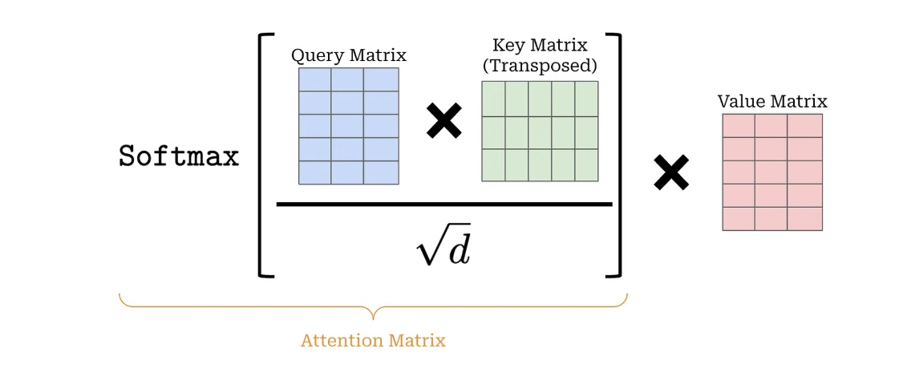
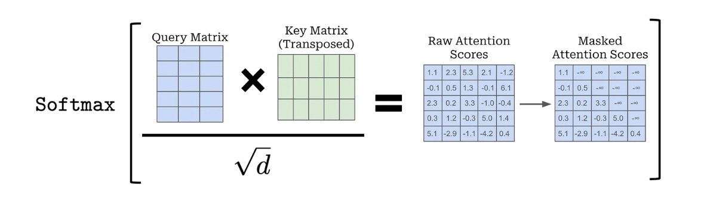
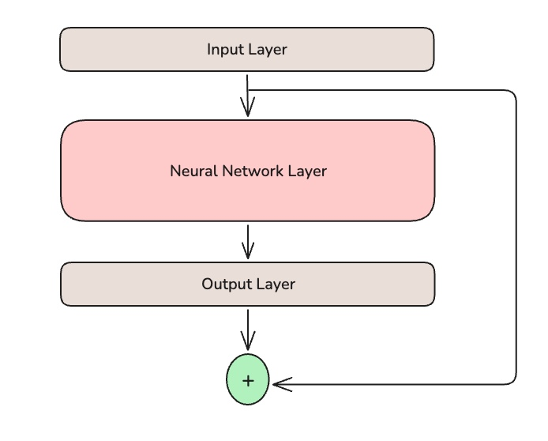
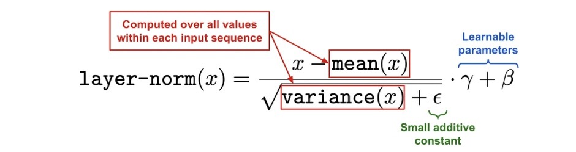
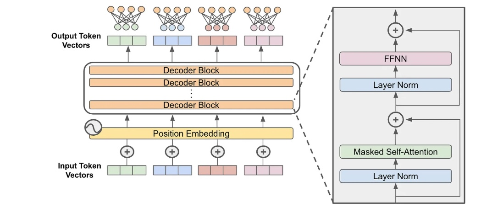
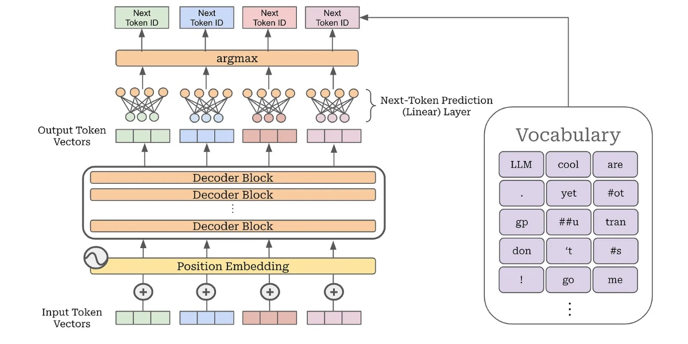
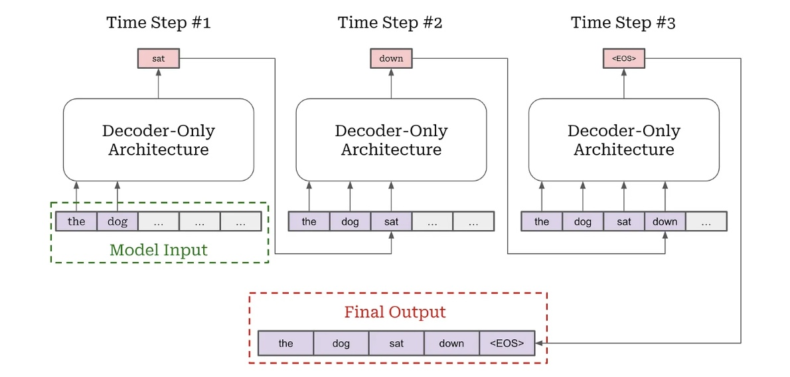

# GPT Components

Here you can find internal implementation of GPT. It is designed to illustrate the mechanics of GPT architecture in a clear and modular way.

## Key Components

1- Token & Positional Embeddings – convert raw input tokens into continuous vector representations while preserving order.

2- Multi-Head Self-Attention – allows the model to focus on different positions of the sequence simultaneously.

3- Feed-Forward Network (MLP) – applies non-linear transformations to enrich learned representations.

4- Residual Connections & Layer Normalization – stabilize training and improve gradient flow.

4- Stacked Transformer Blocks – form the deep architecture that powers language understanding and generation.

5- Output Projection & Softmax – map hidden states back to vocabulary space for prediction.


### Tokenizer Sample: 

Tokenization. The initial step in preparing input for a large language model (LLM) involves dividing the raw text—essentially a sequence of characters—into individual units known as tokens. This procedure is referred to as tokenization.

```
import tiktoken
import torch

tokenizer = tiktoken.get_encoding("gpt2")
text="This will be tokenized"
VOCABULARY_SIZE: int = 128000
EMBEDDING_DIM: int = 768
token_embedding_layer = torch.nn.Embedding(
    num_embeddings=VOCABULARY_SIZE,
    embedding_dim=EMBEDDING_DIM,
)

```
Token IDs and Embeddings. Every token in an LLM’s vocabulary is mapped to a unique integer identifier. For instance, tokenizing the example text produces the sequence: [2338, 4, 43, 11, 73, 832]. Each of these IDs corresponds to a vector representation—called a token embedding—stored in the model’s embedding layer. The embedding layer is essentially a large matrix, where each row contains the embedding for a specific token. Retrieving a token’s embedding is simply a matter of looking up the row associated with its ID.

## Self-Attention in nutshell

Self-Attention. Self-attention is a mechanism that updates the representation of each token in a sequence by considering its relationships with all other tokens, including itself. In practice, this means the model learns which tokens are most relevant when interpreting a given token’s meaning. Formally, an attention function maps a query and a set of key–value pairs to an output, computed as a weighted sum of the values, where the weights are determined by a compatibility measure between the query and the keys. For example, the token making may place higher weight on the tokens more and difficult, since together they clarify the overall meaning of the sentence

### 1- Scaled Dot-Product Attention

Given an input token matrix of size ```[𝐶,n_embd]``

C is the number of tokens and 
n_embd is the embedding dimension

the model first applies three independent linear projections to produce three new vector sets: queries (Q), keys (K), and values (V). The attention mechanism works in three main steps:

1- Similarity scores: Compute the dot product between each query and all keys, giving a measure of how strongly a token should attend to others.
2- Scaling: Divide these scores by square root of 𝑑, to prevent values from becoming too large, which stabilizes training.
3- Weighting: Apply a softmax to turn the scores into probabilities, then use them to take a weighted sum of the value vectors.

This produces new representations where each token is enriched by information from the most relevant tokens in the sequence. We can efficiently compute all pairwise attention scores in a sequence by:

1- Stacking the query and key vectors into two matrices.
2- Multiplying the query matrix with the transposed key matrix.

This operation forms a matrix of size [C, C]—called the attention matrix




### 2- Masked Self-Attention

In contrast to standard (bidirectional) self-attention, decoder-only transformers use masked self-attention. This mechanism restricts each token’s view of the sequence by preventing it from attending to future tokens. Concretely, positions corresponding to later tokens are “masked out” in the attention matrix, ensuring that each token representation is computed only from itself and the tokens that precede it. This enforces causality, which is essential for autoregressive text generation.



### 3- Computing the Output

After obtaining the attention scores, the output of self-attention is computed as a weighted sum of the value vectors, with the attention scores serving as the weights. In practice, this is done by multiplying the attention matrix with the value matrix. Importantly, self-attention preserves the input’s shape: for each input token vector, it produces a transformed output vector of the same dimension d, so output size become ```[C,d]```

### 4- Sample of Self-Attention Implementation:

```
import math
import torch
from torch import nn
import torch.nn.functional as F

class CausalSelfAttention(nn.Module):

    def __init__(
        self,
        d,
        H,
        T,
        bias=False,
        dropout=0.2,
    ):
        """
        Arguments:
        d: size of embedding dimension
        H: number of attention heads
        T: maximum length of input sequences (in tokens)
        bias: whether or not to use bias in linear layers
        dropout: probability of dropout
        """
        super().__init__()
        assert d % H == 0

        # key, query, value projections for all heads, but in a batch
        # output is 3X the dimension because it includes key, query and value
        self.c_attn = nn.Linear(d, 3*d, bias=bias)

        # projection of concatenated attention head outputs
        self.c_proj = nn.Linear(d, d, bias=bias)

        # dropout modules
        self.attn_dropout = nn.Dropout(dropout)
        self.resid_dropout = nn.Dropout(dropout)
        self.H = H
        self.d = d

        # causal mask to ensure that attention is only applied to
        # the left in the input sequence
        self.register_buffer("mask", torch.tril(torch.ones(T, T))
                                    .view(1, 1, T, T))

    def forward(self, x):
        B, T, _ = x.size() # batch size, sequence length, embedding dimensionality

        # compute query, key, and value vectors for all heads in batch
        # split the output into separate query, key, and value tensors
        q, k, v  = self.c_attn(x).split(self.d, dim=2) # [B, T, d]

        # reshape tensor into sequences of smaller token vectors for each head
        k = k.view(B, T, self.H, self.d // self.H).transpose(1, 2) # [B, H, T, d // H]
        q = q.view(B, T, self.H, self.d // self.H).transpose(1, 2)
        v = v.view(B, T, self.H, self.d // self.H).transpose(1, 2)

        # compute the attention matrix, perform masking, and apply dropout
        att = (q @ k.transpose(-2, -1)) * (1.0 / math.sqrt(k.size(-1))) # [B, H, T, T]
        att = att.masked_fill(self.mask[:,:,:T,:T] == 0, float('-inf'))
        att = F.softmax(att, dim=-1)
        att = self.attn_dropout(att)

        # compute output vectors for each token
        y = att @ v # [B, H, T, d // H]

        # concatenate outputs from each attention head and linearly project
        y = y.transpose(1, 2).contiguous().view(B, T, self.d)
        y = self.resid_dropout(self.c_proj(y))
        return y
```


## Feed-Forward Networks

Alongside masked self-attention, each transformer block includes a pointwise feed-forward transformation. This component processes each token vector independently by passing it through the same feed-forward neural network. Typically, this network consists of two linear layers separated by a non-linear activation function (such as ReLU, GeLU, or SwiGLU). The hidden layer is usually much larger than the token embedding dimension—often by a factor of four. In practice, such feed-forward networks can be implemented in PyTorch using the nn.Linear module. Following shows sample example of FF:

```
from torch import nn

class MLP(nn.Module):

    def __init__(
        self,
        d,
        bias=False,
        dropout=0.2
    ):
        """
        Arguments:
        d: size of embedding dimension
        bias: whether or not to use bias in linear layers
        dropout: probability of dropout
        """

        super().__init__()
        self.c_fc    = nn.Linear(d, 4 * d, bias=bias)
        self.gelu    = nn.GELU()
        self.c_proj  = nn.Linear(4 * d, d, bias=bias)
        self.dropout = nn.Dropout(dropout)

    def forward(self, x):
        x = self.c_fc(x)
        x = self.gelu(x)
        x = self.c_proj(x)
        x = self.dropout(x)
        return x
```

## Residual Connections
A residual connection works by adding a layer’s input to its output before passing the result to the next layer. Instead of forwarding only the transformed output, the network preserves the original input signal and combines it with the layer’s output. This simple addition helps stabilize training and allows deeper networks to learn more effectively.



## Layer Normalizing

Layer normalization is the most widely used normalization method in transformers and large language models, stabilizing training by normalizing activations across each feature in a layer. It consists of two parts: normalizing the activations and applying a learnable affine transformation via a weight and bias, both trainable along with the model. The normalization ensures consistent activation scales, reducing issues like exploding or vanishing gradients, improving the stability and speed of training, and enabling deeper models. Placing layer normalization before or after residual connections (Pre-LN vs Post-LN) can significantly impact gradient flow and the need for learning rate warm-up during training.



code base for residual connection and layer normalization:

```
from torch import nn

class Block(nn.Module):
    def __init__(
        self,
        d,
        H,
        T,
        bias=False,
        dropout=0.2,
    ):
        """
        Arguments:
        d: size of embedding dimension
        H: number of attention heads
        T: maximum length of input sequences (in tokens)
        bias: whether or not to use bias in linear layers
        dropout: probability of dropout
        """

        super().__init__()
        self.ln_1 = nn.LayerNorm(d)
        self.attn = CausalSelfAttention(d, H, T, bias, dropout)
        self.ln_2 = nn.LayerNorm(d)
        self.ffnn = MLP(d, bias, dropout)

    def forward(self, x):
        x = x + self.attn(self.ln_1(x))
        x = x + self.ffnn(self.ln_2(x))
        return x
```

## Stacking Blocks

Once the structure of the input and a single block in a decoder-only transformer is understood, the rest of the architecture follows a simple pattern: the same block is stacked repeatedly, L times. Throughout this stacking, the input tensor maintains its shape, typically [B, C, d], so that after passing through all L blocks, the final output retains these dimensions.





sample code snippet of the implementation:

```
import torch
from torch import nn
import torch.nn.functional as F

class GPT(nn.Module):

    def __init__(self, 
        d,
        H,
        C,
        V,
        layers,
        bias=False,
        dropout=0.2,
    ):
        """
        Arguments:
        d: size of embedding dimension
        H: number of attention heads
        C: maximum length of input sequences (in tokens)
        V: size of the token vocabulary
        layers: number of decoder-only blocks
        bias: whether or not to use bias in linear layers
        dropout: probability of dropout
        """

        super().__init__()
        self.transformer = nn.ModuleDict(dict(
            wte=nn.Embedding(V, d), # token embeddings
            wpe=nn.Embedding(C, d), # position embeddings
            drop=nn.Dropout(dropout),
            blocks=nn.ModuleList([Block(d, H, C, bias, dropout) for _ in range(layers)]),
            ln_f=nn.LayerNorm(d),
            head=nn.Linear(d, V, bias=bias),
        ))

    def forward(self, idx, targets=None):
        # idx is a [B, C] matrix of token indices
        # targets is a [B, C] matrix of target (next) token indices
        device = idx.device
        _, C = idx.size() # [B, C]
        pos = torch.arange(0, C, dtype=torch.long, device=device)

        # generate token and position embeddings
        tok_emb = self.transformer.wte(idx) # [B, C, d]
        pos_emb = self.transformer.wpe(pos) # [C, d]
        x = self.transformer.drop(tok_emb + pos_emb)

        # pass through all decoder-only blocks
        for block in self.transformer.blocks:
            x = block(x)
        x = self.transformer.ln_f(x) # final layer norm

        if targets is not None:
            # compute the loss if we are given targets
            logits = self.transformer.head(x)
            loss = F.cross_entropy(
                logits.view(-1, logits.size(-1)),
                targets.view(-1),
                ignore_index=-1,
            )
        else:
            # only look at last token if performing inference
            logits = self.transformer.head(x[:, [-1], :])
            loss = None

        return logits, loss
```

## Generating Output

Large language models are trained for a single core task: next-token prediction. Given a sequence of input tokens, the model outputs a corresponding sequence of token representations. To predict the next token, here are steps:

1- Take the output embedding of a chosen token.
2- Pass it through a linear layer that maps to the vocabulary size.
3- Select the most likely token ID (e.g., via argmax).

To generate text, this procedure is repeated in an autoregressive loop. Starting from a prompt, the model processes the sequence, predicts the next token, appends it to the input, and then uses the extended sequence as the new input. Iterating this process produces coherent text, which is how all decoder-only LLMs generate language.


