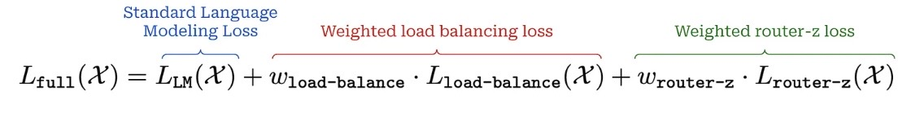

# Mixture-of-Experts GPT

A comprehensive implementation of Mixture-of-Experts (MoE) GPT models with multiple training strategies optimized for different hardware configurations and production requirements.

## Overview

This project implements a state-of-the-art Mixture-of-Experts GPT model that combines the efficiency of sparse expert routing with the power of transformer architectures. The implementation provides four distinct training approaches, each optimized for specific use cases ranging from development to large-scale production deployment.

### Key Features

- **Multiple Training Strategies**: CPU, single GPU, mixed precision, and distributed multi-GPU training
- **Advanced Optimizations**: TF32, mixed precision, model compilation, and memory management
- **Production Ready**: Comprehensive monitoring, checkpointing, and experiment tracking
- **Flexible Architecture**: Configurable expert count, routing strategies, and model parameters
- **Hardware Agnostic**: Support for CPU, single GPU, and multi-GPU environments

### Why MoE GPT?

Traditional dense transformer models face a fundamental scaling challenge: as model size increases, computational requirements grow quadratically. MoE models solve this by:

1. **Sparse Activation**: Only a subset of experts are active per token, reducing computational cost
2. **Parameter Efficiency**: More parameters with similar computational requirements
3. **Scalability**: Linear scaling with expert count while maintaining inference speed
4. **Specialization**: Different experts can specialize in different types of tasks or data


## Training Options

This MoE GPT implementation provides 4 different training approaches, each optimized for different use cases and hardware requirements. 

| Use Case | Recommended Trainer | Why |
|----------|-------------------|-----|
| Development/Testing | `trainer_on_cpu.py` | No GPU required, fast iteration |
| Single GPU Production | `trainer_mixed_precision.py` | Best performance + memory efficiency |
| Multi-GPU Production | `trainer_distributed_gpu.py` | Maximum performance and scalability |
| Memory Constrained | `trainer_mixed_precision.py` | 50% memory reduction with mixed precision |
| Maximum Speed | `trainer_distributed_gpu.py` | Linear scaling with GPUs + compilation |


### 1. CPU Training (`trainer_on_cpu.py`)
**Best for: Development, testing, small models, CPU-only environments**

```bash
uv run python moe_gpt/train/trainer_on_cpu.py
```

**Features:**
- Standard PyTorch CPU operations without GPU dependencies
- Compatible with any CPU architecture (x86, ARM, etc.)
- Memory management with batch prefetching and memory pooling
- No CUDA or GPU requirements
- Perfect for development and testing

**Requirements:**
- Any modern CPU (x86_64, ARM64, etc.)
- Sufficient RAM for model and batch size
- No GPU installation required

### 2. Single GPU Training (`trainer_on_gpu.py`)
**Best for: Single GPU setups, production training, high-throughput scenarios**

```bash
uv run python moe_gpt/train/trainer_on_gpu.py
```

**Features:**
- TF32 (Tensor Float 32-bit) support for ~1.5x faster matrix operations
- cuDNN TF32 optimization for faster convolutions
- CUDA memory pinning for faster CPU-GPU data transfer
- Non-blocking GPU transfers for improved pipeline efficiency
- Advanced memory management with batch prefetching

**Requirements:**
- GPU: Ampere architecture (RTX 30xx, A100, etc.) for TF32 support
- PyTorch: 1.7+ for TF32 compatibility
- CUDA: 11.0+ for TF32 operations
- Sufficient GPU memory for model and batch size

### 3. Mixed Precision Training (`trainer_mixed_precision.py`)
**Best for: Large MoE models, memory-constrained environments, production training**

```bash
uv run python moe_gpt/train/trainer_mixed_precision.py
```

**Features:**
- Mixed Precision Training: bfloat16/float16 with automatic detection
- All GPU optimizations from `trainer_on_gpu.py`
- Memory savings from mixed precision (up to 50% memory reduction)
- ~1.5x speedup over standard FP32 training
- ~99.9% accuracy retention with TF32 + mixed precision optimizations

**Requirements:**
- GPU: Ampere architecture (RTX 30xx, A100, etc.) for TF32 support
- PyTorch: 1.7+ for TF32 compatibility and mixed precision
- CUDA: 11.0+ for TF32 operations
- Sufficient GPU memory (reduced requirements due to mixed precision)

### 4. Distributed Multi-GPU Training (`trainer_distributed_gpu.py`)
**Best for: Large-scale training, production environments, maximum performance**

```bash
# Single node, multiple GPUs
uv run python moe_gpt/train/trainer_distributed_gpu.py

# Multi-node training
torchrun --nproc_per_node=4 --nnodes=2 --node_rank=0 --master_addr="192.168.1.1" --master_port=1234 moe_gpt/train/trainer_distributed_gpu.py
```

**Features:**
- Distributed Data Parallel (DDP) for multi-GPU training
- All mixed precision optimizations
- PyTorch 2.0 Model Compilation for additional 1.2-1.5x speedup
- Wandb experiment tracking and logging
- Gradient accumulation for large effective batch sizes
- Linear scaling with number of GPUs (2x GPUs = ~2x speed)
- Advanced memory management and monitoring

**Requirements:**
- Multiple GPUs: 2+ GPUs for DDP training
- GPU: Ampere architecture (RTX 30xx, A100, etc.) for TF32 support
- PyTorch: 2.0+ for model compilation support
- CUDA: 11.0+ for TF32 operations
- NCCL: For multi-GPU communication
- Sufficient GPU memory per GPU

## Configuration

All trainers use YAML configuration files for easy customization. Key settings include:

- **Model settings**: Architecture, expert count, routing parameters
- **Training settings**: Batch size, learning rate, optimization
- **Memory settings**: Buffer size, prefetching, memory pooling
- **Device settings**: GPU/CPU selection, distributed training options
- **Wandb settings**: Experiment tracking and logging


## MoE Internals


### Architecture Overview

The MoE-GPT implementation follows a modular architecture where expert layers can be selectively applied to transformer blocks. As we have seen in main page here is architecture design of MoE-GPT:


## MoE-GPT Core Components

## Expert

MoE feedforward layer work by swapping out certain parts of the model with multiple versions of that part, called experts. Each expert has its own parameters. A gating mechanism then decides which experts should process each piece of input, so not all experts are used at once.


You don’t need to replace every feed-forward layer with experts. Usually, MoE models only apply this to every P-th layer, while the rest remain standard. This approach balances efficiency and performance, as shown in the pseudocode below:

```
transformer_blocks = []
for i in range(num_blocks):
    use_moe = (i % P) == 0

    # Regular block if False, expert layer if True
    transformer_blocks.append(Block(use_moe=use_moe))
```

# Router
The main advantage of MoE is efficiency. But just adding experts doesn’t help—it actually makes the model bigger and slower. The trick is to only use a few experts at a time for each input, so the model feels much larger but runs at nearly the same cost.

When a token (a vector of size d) goes through an MoE layer, the system “routes” it to just k experts, not all of them. Picking which experts handle each token is the routing problem.


The routing system determines which experts should process each token:

```python
# Simplified routing logic
def route_tokens(tokens, num_experts, top_k):
    # Compute routing scores
    scores = router_network(tokens)
    
    # Select top-k experts
    top_k_scores, top_k_indices = torch.topk(scores, top_k)
    
    # Apply gating function
    gates = softmax(top_k_scores)
    
    return gates, top_k_indices
```
## Load Balancer

Because only a few experts are active at a time, MoE introduces the idea of active parameters: only the parameters of the selected experts matter for that token. So the actual computation depends on these active parameters, not the full parameter count of the model. To make training more hardware-friendly, MoEs often set a fixed expert capacity—a cap on how many tokens each expert can handle per batch.


To prevent expert collapse (where only a few experts are used) we add a load balancing loss during training. This encourages the model to spread the workload across experts. The loss is based on two things:the implementation includes:

- **Load Balancing Loss**: Encourages uniform expert usage
- **Auxiliary Loss**: Additional regularization for expert diversity
- **Router Z-Loss**: Prevents router outputs from becoming too extreme

following is formulation of router-z implementation:


and combined losses will be as following:




