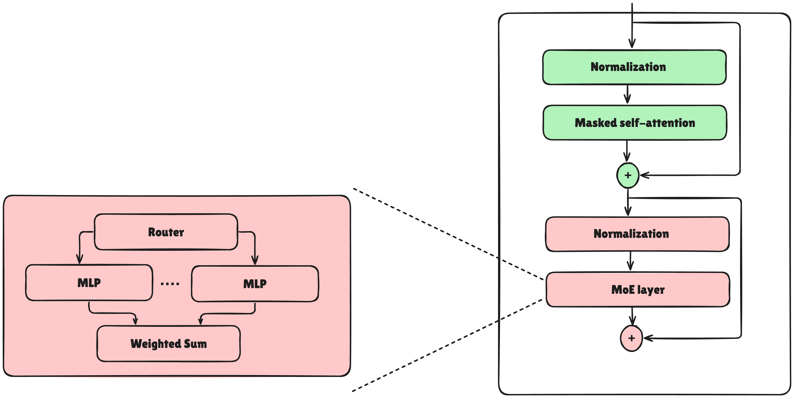
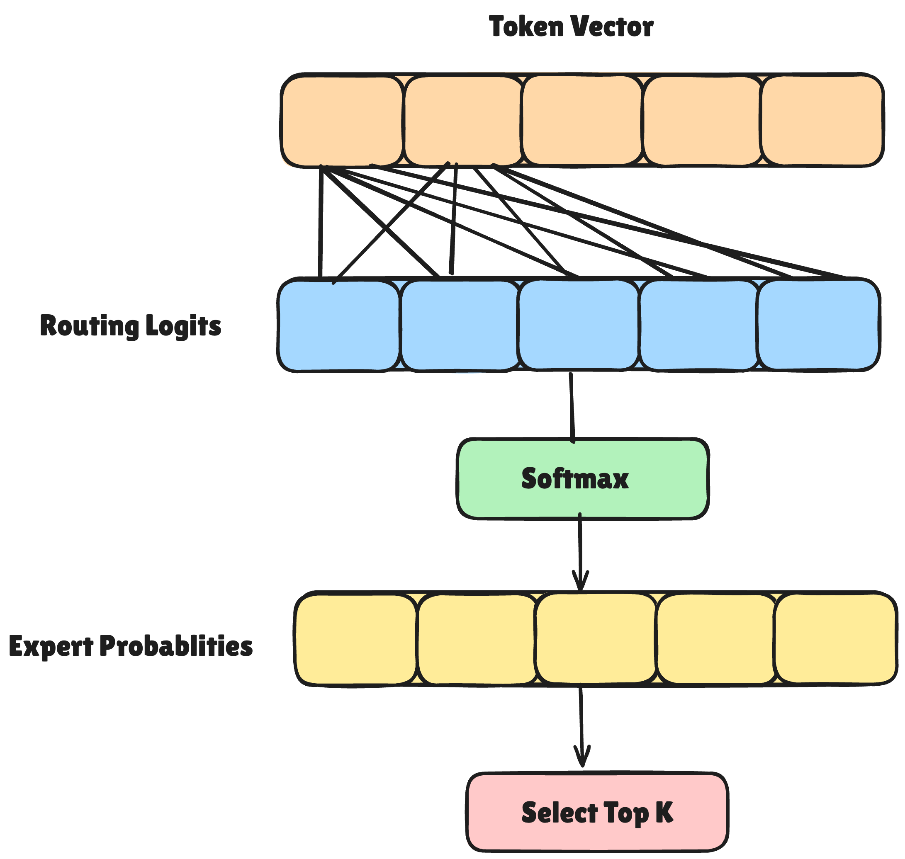
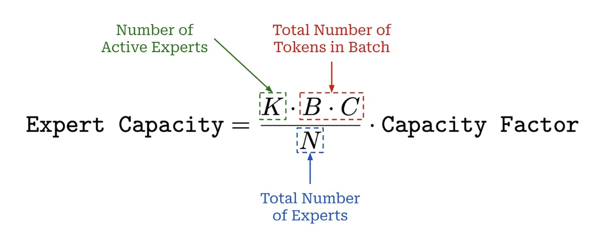
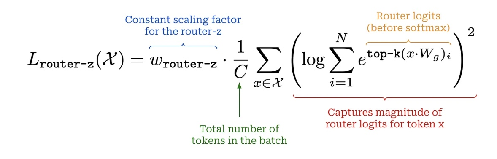

#Mixture-of-Experts


As large language models (LLMs) keep growing, we’re running into the limits of today’s hardware. To get around this, researchers are turning to Mixture-of-Experts (MoE) models, which cut training costs while keeping model quality comparable to big dense models.

MoE layers work by swapping out certain parts of the model with multiple versions of that part, called experts. Each expert has its own parameters. A gating mechanism then decides which experts should process each piece of input, so not all experts are used at once.



In LLMs, the feed-forward layer is often replaced with an MoE layer. Instead of one feed-forward network, you now have many, each acting as an “expert.” Together, they form what’s called an expert layer.

You don’t need to replace every feed-forward layer with experts. Usually, MoE models only apply this to every P-th layer, while the rest remain standard. This approach balances efficiency and performance, as shown in the pseudocode below:

```
transformer_blocks = []
for i in range(num_blocks):
    use_moe = (i % P) == 0

    # Regular block if False, expert layer if True
    transformer_blocks.append(Block(use_moe=use_moe))
```

The main advantage of MoE is efficiency. But just adding experts doesn’t help—it actually makes the model bigger and slower. The trick is to only use a few experts at a time for each input, so the model feels much larger but runs at nearly the same cost.

When a token (a vector of size d) goes through an MoE layer, the system “routes” it to just k experts, not all of them. Picking which experts handle each token is the routing problem.



Because only a few experts are active at a time, MoE introduces the idea of active parameters: only the parameters of the selected experts matter for that token. So the actual computation depends on these active parameters, not the full parameter count of the model. To make training more hardware-friendly, MoEs often set a fixed expert capacity—a cap on how many tokens each expert can handle per batch.



Finally, we don’t want just a few experts to get all the work. To prevent this, we add a load balancing loss during training. This encourages the model to spread the workload across experts. The loss is based on two things:

How much probability the router assigns to each expert.
How many tokens are actually sent to each expert.

By combining these into a single loss term (via a dot product), we encourage uniform usage of experts.


