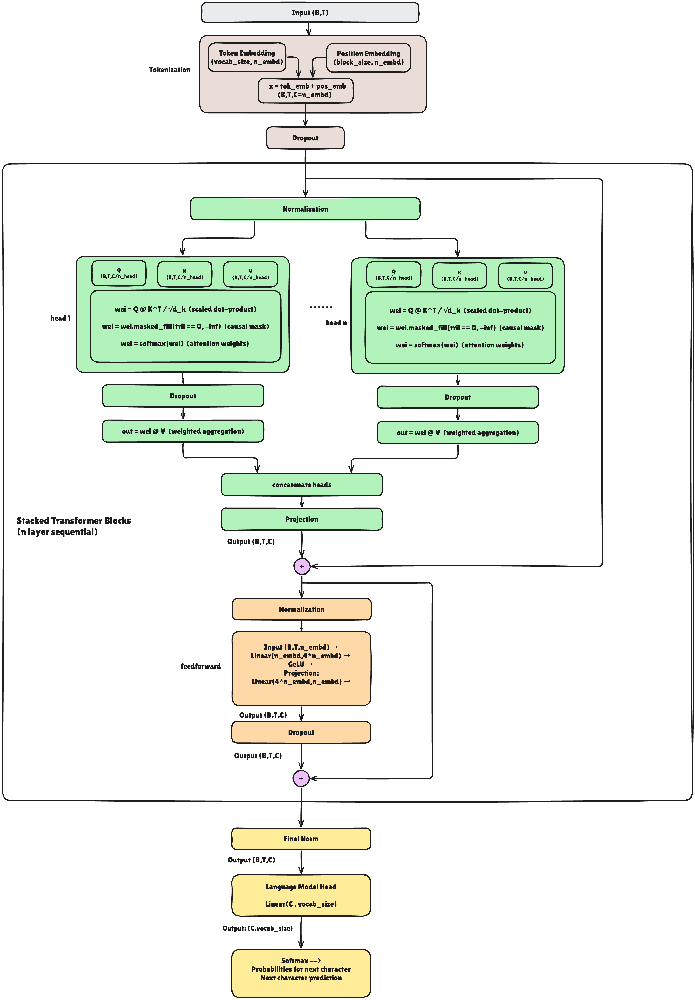

# Labxy 

Labxy is meant as a foundation for experimenting, and extending Transformer architectures. Modern large language models (LLMs) predominantly adopt a decoder-only transformer architecture, omitting separate encoder modules and cross-attention mechanisms typical of encoder-decoder designs. These decoder-only models rely solely on causal self-attention within stacked transformer blocks, enabling efficient and scalable autoregressive text generation. Such a structure is ideal for tasks that require prediction of the next token in a sequence, making it the backbone of systems like GPT-4 and Llama-2. In contrast, encoder-decoder models—which do feature explicit cross-attention for integrating source and target sequences—are primarily reserved for applications like machine translation. Labxy help you deep dive and understand internals of decoder only models and build your own llm from scratch. 

## LLM Architectures

## 1- GPT Architecture & Internals
Following picture shows general architecture of most famous decoder only model: GPT

If you want to dive deep into the internals of GPT architecture and understand how each component works, check out our detailed guide:

📖 **[GPT Internals Guide](GPT_INTERNALS.md)** - Complete breakdown of GPT components including:
- Token & Positional Embeddings
- Multi-Head Self-Attention mechanisms
- Feed-Forward Networks (MLP)
- Residual Connections & Layer Normalization
- Stacked Transformer Blocks
- Output Projection & Text Generation

This guide includes code implementations, mathematical explanations, and visual diagrams to help you understand every aspect of the GPT architecture from the ground up.

