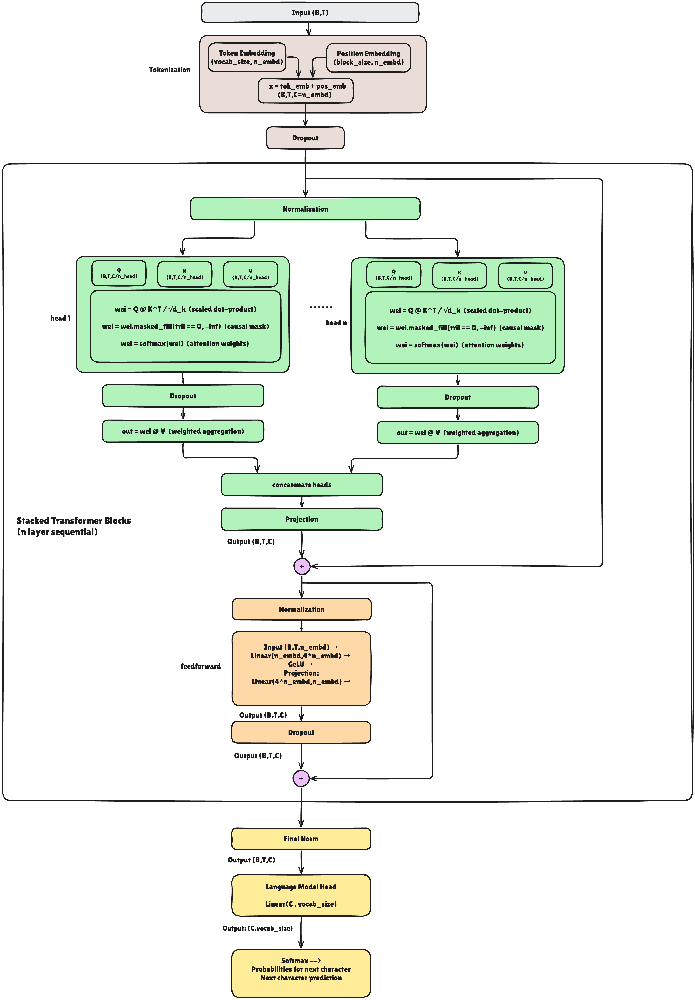

# Nanodecoder 

Nanodecoder is meant as a foundation for experimenting, and extending Transformer architectures. Modern large language models (LLMs) predominantly adopt a decoder-only transformer architecture, omitting separate encoder modules and cross-attention mechanisms typical of encoder-decoder designs. These decoder-only models rely solely on causal self-attention within stacked transformer blocks, enabling efficient and scalable autoregressive text generation. Such a structure is ideal for tasks that require prediction of the next token in a sequence, making it the backbone of systems like GPT-4 and Llama-2. In contrast, encoder-decoder models—which do feature explicit cross-attention for integrating source and target sequences—are primarily reserved for applications like machine translation. Nanodecoder help you deep dive and understand internals of decoder only models and build your own llm from scratch.

## GPT with MoE Architecture

Following image shows the architecture of GPT with MoE:


## MoE Architecture & Internals

If you want to understand how Mixture-of-Experts (MoE) models work and how they scale large language models efficiently, check out our comprehensive guide:

📖 **[MoE Internals Guide](MOE_INTERNALS.md)** - Complete breakdown of MoE components including:
- Expert Layers & Feed-Forward Networks
- Routing Mechanisms & Gating Functions
- Expert Capacity & Load Balancing
- Active Parameters vs Total Parameters
- Load Balancing Loss & Training Strategies
- MoE Layer Integration in Transformer Blocks

This guide includes code implementations, mathematical explanations, and visual diagrams to help you understand how MoE models achieve efficiency while maintaining performance in large-scale language models.

## Installation

This project uses `uv` for fast Python package management. To get started:

1. Install `uv` if you haven't already:
   ```bash
   curl -LsSf https://astral.sh/uv/install.sh | sh
   ```

2. Install the project dependencies:
   ```bash
   uv sync
   ```

3. Activate the virtual environment:
   ```bash
   source .venv/bin/activate  # On Unix/macOS
   # or
   .venv\Scripts\activate     # On Windows
   ```

To train your moe model, you can run following command. Data sample of shakespeare.txt is given for now under ```/gpe-moe/data/train_data/shakespeare.txt``` . You can change your data source based on reqs:

```bash
uv run python gpt-moe/train/gpt_train.py
``` 
To load weights from trained models you can use following command

## GPT Architecture
Following picture shows architecture of GPT



If you want to dive deep into the internals of GPT architecture and understand how each component works, check out our detailed guide:

📖 **[GPT Internals Guide](GPT_INTERNALS.md)** - Complete breakdown of GPT components including:
- Token & Positional Embeddings
- Multi-Head Self-Attention mechanisms
- Feed-Forward Networks (MLP)
- Residual Connections & Layer Normalization
- Stacked Transformer Blocks
- Output Projection & Text Generation

This guide includes code implementations, mathematical explanations, and visual diagrams to help you understand every aspect of the GPT architecture from the ground up.


To train your model, you can run following command. Data sample of shakespeare.txt is given for now under ```/gpt/data/train_data/shakespeare.txt``` . You can change your data source based on reqs:

```bash
uv run python gpt/train/gpt_train.py
``` 
To load weights from trained models you can use following command

```bash
uv run python gpt/wight_loader/gpt2_weights_evaluator.py
```

To fine-tune the model, 2 fine-tuning examples is considered you can extend on that. First is for simple ham/spam classification fine tuner. Other is instruction following fine-tuner, again you can change the finetuning head and data based on your needs:

``` bash
uv run python gpt/fine_tuning/instruction_head_fine_tuning/instruction_head_find_tuner.py
```

```bash
uv run python gpt/fine_tuning/spam_head_fine_tuning/spam_head_fine_tuner.py
```
